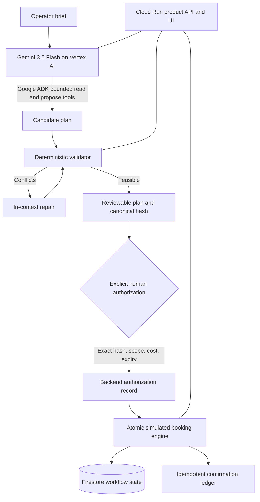

# Offsite Captain

Offsite Captain is an agentic coordinator for startup offsites. It turns a
distributed team's travel constraints, meeting goals, preparation work, venue
inventory, and activity options into one feasible plan—then pauses at a clear
human authorization boundary before creating simulated reservations.

The project is being built for the All Things Agentic Hackathon with Gemini on
Vertex AI, Google ADK, and Google Cloud. Development and
review are performed in Codex; Gemini is the product's runtime reasoning model.

**Hosted demo:** https://offsite-captain-pgg2be7x2a-ue.a.run.app/product/

## Product walkthrough

1. **Brief** — collect the city, dates, budget, attendees, travel origins,
   dietary/accessibility needs, and required outcomes.
2. **Coordinate** — Gemini uses bounded read/propose tools to inspect synthetic
   hotel, room, and activity inventory and construct an agenda.
3. **Validate** — deterministic backend rules check arrival buffers, attendance,
   dependencies, preparation ownership, inventory versions, and budget.
4. **Review** — present a decision-ready plan with its total cost, assumptions,
   and exceptions. No reservation exists yet.
5. **Authorize** — a human explicitly authorizes the exact plan hash for a
   short-lived session.
6. **Reserve** — the backend performs an atomic, idempotent simulated booking and
   returns a confirmation ledger. Expired approvals and changed inventory fail
   safely without partial reservations.

## Safety boundary

The LLM can read constraints, search synthetic inventory, validate candidates,
and submit a proposal. It cannot call the booking engine. Reservation creation
requires a backend-held, session-bound approval for the exact canonical plan
hash. Authorizations expire after ten minutes, newer approvals supersede older
ones, and repeated booking requests return the original confirmation ledger.

All inventory and reservation activity is simulated for the hackathon demo. The
application does not purchase travel or contact real hotels or venues.

## Architecture



Key modules:

- `app/agent.py` — ADK agent definition and runtime instructions.
- `app/tools.py` — bounded tools available to Gemini.
- `app/validators.py` — deterministic feasibility and policy checks.
- `app/approvals.py` — recoverable, session-bound authorization semantics.
- `app/booking.py` — atomic and idempotent simulated reservations.
- `app/scenarios.py` — the deterministic demo brief and synthetic inventory.

## Local development

Requirements: Python 3.11–3.13, [`uv`](https://docs.astral.sh/uv/), the Google
Cloud SDK, and Application Default Credentials with access to Vertex AI.

```bash
uv sync --extra lint
gcloud auth application-default login
export GOOGLE_CLOUD_PROJECT="your-project-id"
export GOOGLE_CLOUD_LOCATION="global"
uv run agents-cli playground
```

Run the standalone operator interface without invoking Vertex AI:

```bash
uv run uvicorn app.product_app:app --reload
```

To preserve reviewed plans, approvals, consumed inventory, and confirmation
ledgers across local process restarts, set a SQLite state path:

```bash
export OFFSITE_STATE_BACKEND="sqlite"
export OFFSITE_STATE_DB=".local/offsite-captain.db"
uv run uvicorn app.product_app:app --reload
```

SQLite is the restart-safe local/demo adapter. Cloud Run must use a shared
transactional repository such as Firestore through the same `WorkflowRepository`
boundary; container-local files are intentionally not presented as production
durability.

For Cloud Run, configure the shared Firestore adapter:

```bash
OFFSITE_STATE_BACKEND=firestore
GOOGLE_CLOUD_PROJECT=your-project-id
FIRESTORE_DATABASE=(default)
OFFSITE_STATE_COLLECTION=offsite_workflows
```

The runtime service account uses application-default credentials and needs
`roles/datastore.user`, `roles/aiplatform.user`, `roles/logging.logWriter`,
`roles/monitoring.metricWriter`, and `roles/cloudtrace.agent`; no service-account
key is stored in the application.
The current snapshot adapter requires one Cloud Run instance to preserve the
same serialized booking semantics as the in-process lock. Deploy with
`--max-instances 1 --concurrency 8` until Firestore compare-and-swap transactions
are implemented. The hosted health probes are available at `/health` and
`/readyz`.

The verified production deployment uses project `offsite-captain-2026` and
region `us-east1`. From an authenticated shell, create or select a billed Google
Cloud project, enable the required services, create a Firestore Native database,
and deploy the exact container entrypoint:

```bash
export GOOGLE_CLOUD_PROJECT="your-project-id"
export GOOGLE_CLOUD_REGION="us-east1"

gcloud services enable \
  run.googleapis.com \
  firestore.googleapis.com \
  aiplatform.googleapis.com \
  artifactregistry.googleapis.com \
  cloudbuild.googleapis.com \
  --project="$GOOGLE_CLOUD_PROJECT"

gcloud firestore databases create \
  --database="(default)" \
  --location="$GOOGLE_CLOUD_REGION" \
  --type=firestore-native \
  --project="$GOOGLE_CLOUD_PROJECT"

gcloud iam service-accounts create offsite-captain-runtime \
  --display-name="Offsite Captain Cloud Run runtime" \
  --project="$GOOGLE_CLOUD_PROJECT"

gcloud artifacts repositories create cloud-run-source-deploy \
  --repository-format=docker \
  --location="$GOOGLE_CLOUD_REGION" \
  --description="Cloud Run source builds for Offsite Captain" \
  --project="$GOOGLE_CLOUD_PROJECT"

for role in \
  roles/datastore.user \
  roles/aiplatform.user \
  roles/logging.logWriter \
  roles/monitoring.metricWriter \
  roles/cloudtrace.agent; do
  gcloud projects add-iam-policy-binding "$GOOGLE_CLOUD_PROJECT" \
    --member="serviceAccount:offsite-captain-runtime@$GOOGLE_CLOUD_PROJECT.iam.gserviceaccount.com" \
    --role="$role" \
    --condition=None
done

gcloud run deploy offsite-captain \
  --source=. \
  --project="$GOOGLE_CLOUD_PROJECT" \
  --region="$GOOGLE_CLOUD_REGION" \
  --service-account="offsite-captain-runtime@$GOOGLE_CLOUD_PROJECT.iam.gserviceaccount.com" \
  --allow-unauthenticated \
  --set-env-vars="OFFSITE_STATE_BACKEND=firestore,GOOGLE_CLOUD_PROJECT=$GOOGLE_CLOUD_PROJECT,GOOGLE_CLOUD_LOCATION=global,GOOGLE_GENAI_USE_VERTEXAI=True,OFFSITE_STATE_COLLECTION=offsite_workflows" \
  --min-instances=0 \
  --max-instances=1 \
  --concurrency=8 \
  --cpu=1 \
  --memory=1Gi \
  --timeout=300
```

If the default Firestore database already exists, skip its creation command.
Verify the deployed service with `GET /health`, `GET /readyz`, and the complete
operator flow at `/product/`.

Then open `http://127.0.0.1:8000/product/`.

The runtime model defaults to `gemini-3.5-flash`. Override it only when testing
an intentional model change:

```bash
export MODEL="gemini-3.5-flash"
```

## Verification

```bash
uv run pytest tests/unit -q
uv run ruff check app tests/unit
uv run ty check app/models.py app/scenarios.py app/hashing.py app/approvals.py app/booking.py
```

Live ADK tests are deliberately opt-in because they invoke Vertex AI:

```bash
RUN_LIVE_ADK_TESTS=1 uv run pytest tests/integration -q
```

The committed two-case ADK evaluation covers seeded-plan repair and resistance
to booking/approval bypass. The latest run passed response quality, hallucination,
the human action boundary, and tool policy at 100%. See
[`docs/evaluation.md`](docs/evaluation.md) for evidence and reproduction commands.

Current deterministic baseline: 28 unit tests passing, including coordination,
validation, authorization, expiry, inventory failure, idempotency, and atomic
booking behavior across a process restart. The operator UI maps authorization
expiry, stale plans, inventory changes, and network interruptions to distinct,
safe recovery paths. The Cloud Run image builds successfully and its packaged
product route, health probes, and reservation contract have a local smoke test.
The final Impeccable UI pass scores 20/20 after resolving the full accessibility,
responsive, interaction, typography, and design-system audit.

## Submission materials

- [Public 1:31 narrated demo](https://youtu.be/TrWWCVCx-yI) — live
  Gemini 3.5 Flash and Google ADK coordination through human-authorized,
  simulated reservations.
- [`docs/demo-script.md`](docs/demo-script.md) — timed sub-four-minute recording
  script and public-video checklist.
- [`docs/devpost-submission.md`](docs/devpost-submission.md) — prepared Devpost
  write-up, custom answers, judge instructions, and remaining submission gates.
- [`diagrams/offsite-captain-architecture.png`](diagrams/offsite-captain-architecture.png)
  — upload-ready architecture diagram, with Mermaid, SVG, and editable
  Excalidraw sources in the same directory.

## Status

The deterministic coordination core, live Gemini/ADK path, evaluated action
boundary, session-isolated product API, and review/approval UI are implemented.
The confirmation state provides an operating handoff with exact simulated
confirmation IDs, preparation owners, a decision trail, a copyable summary, and
the preserved authorization record. Transactional SQLite makes the local
workflow restart-safe, and the production deployment uses Firestore with the
Cloud Run runtime identity. Single-instance hosted verification is complete.
Hackathon submission remains an explicit human-approved action.

## License

License selection is pending before the first public release milestone.
